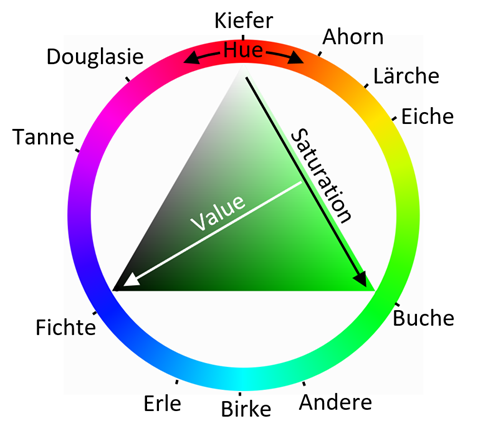

# HSV-kodierte Baumartenanteile (Visualisierungslayer)
Dieser Layer dient der schnellen visuellen Erfassung von Baumartenmischungen und ist speziell für eine erste explorative Analyse und Kartendarstellung von Rein- und Mischbeständen konzipiert. Die Darstellung basiert auf einer HSV-Farbcodierung, die aus den Baumartenanteilen pro Pixel abgeleitet wird.
Die Farbcodierung ist wie folgt definiert:
Hue (Farbton): Der Farbton ist je Pixel durch einen festgelegten Winkel definiert, der der dominanten Baumart entspricht. Jede Baumartengruppe ist somit eindeutig einer Grundfarbe zugeordnet (siehe Schaubild).
Saturation (Sättigung): Die Farbsättigung entspricht dem Anteil der dominanten Baumart innerhalb des Pixels. Hohe Sättigungswerte kennzeichnen Pixel mit hohem Dominanzanteil (nahe Reinbestand), während geringe Sättigung auf Mischbestände mit ähnlichen Anteilen mehrerer Baumarten hinweist.
Value (Helligkeit): Der Value-Wert wird durch den kombinierten Anteil der Hintergrundklassen Schatten und Boden bestimmt. Pixel mit hohem Schatten- oder Bodenanteil erscheinen dunkler, was auf eine geringere oder verdeckte Baumdeckung hinweist.
Die numerischen Werte dieses Raster Layers stellen ausschließlich die technischen Umrechnungen der HSV-Farbwerte in den RGB-Farbraum dar. Sie besitzen keine eigenständige inhaltliche oder quantitative Bedeutung und sind nicht für analytische Auswertungen vorgesehen.
Der Layer ist ausdrücklich als Visualisierungshilfe zu verstehen. Er ermöglicht es, räumliche Muster der Baumartenzusammensetzung sowie Übergänge zwischen Rein- und Mischbeständen auf einen Blick zu erkennen. Für quantitative Analysen sind die zugrunde liegenden Layer der Baumartenanteile bzw. der dominanten Baumart heranzuziehen.
Folgendes Schaubild erläutert die Zuordnung der Baumarten zu den jeweiligen Farbtönen und unterstützt die Interpretation der Darstellung: 

## Early Access

Dieser Layer wird im Rahmen des Forschungsprojektes ForestPulse als Early-Access-Produkt bereitgestellt. Die enthaltenen Daten, Methoden und Klassifikationsergebnisse befinden sich noch in der Entwicklung und können sich von zukünftigen Versionen unterscheiden. Insbesondere sind Anpassungen an der Methodik sowie an der Genauigkeit möglich.
Der Datensatz dient der frühzeitigen Nutzung und Evaluation und erhebt keinen Anspruch auf Vollständigkeit oder amtliche Verbindlichkeit. Rückmeldungen aus der Nutzung sind ausdrücklich erwünscht und fließen in die Weiterentwicklung des Produkts ein.
